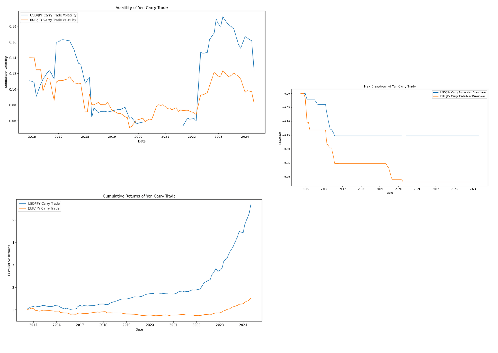

# Yen Carry Trade Analysis

## Overview

This project analyzes carry trades involving the Japanese Yen (JPY). Carry trading involves borrowing in a currency with a low interest rate and investing in a currency with a higher interest rate, aiming to profit from the difference in rates. This analysis focuses on USD/JPY and EUR/JPY carry trades, assessing their performance, volatility, and maximum drawdown.

## Explanation of Carry Trade
A carry trade involves borrowing money in a currency with a low interest rate and investing it in a currency with a higher interest rate. The trader profits from the difference between the interest rates, known as the "carry". For example, if the interest rate in Japan is lower than in the US, a trader might borrow in JPY and invest in USD to capture the difference.

## Features

1. **Historical Data Retrieval**: Fetch historical exchange rates and interest rates data using Alpha Vantage and FRED APIs.
2. **Interest Rate Calculations**: Compute interest rate differentials between Japan, the US, and the Eurozone.
3. **Carry Trade Returns**: Calculate and visualize the returns for USD/JPY and EUR/JPY carry trades.
4. **Volatility Measurement**: Measure the annualized volatility of carry trades.
5. **Drawdown Analysis**: Evaluate the maximum drawdown for carry trades, indicating the largest peak-to-trough decline.

### Prerequisites

- Python 3.x
- Required Python libraries: `pandas`, `numpy`, `matplotlib`,  `alpha_vantage`, `requests`

## Visualization

